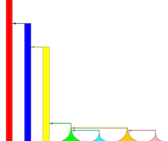

# What we know about maize domestication

# A new paper

Using a beautiful sampling of maize and teosinte populations from across Mexico, @MorenoLetelier seek to reasses the genetic evidence for specific geographic origins of maize domestication. Using a number of different methods, they claim "the likely ancestor of maize may be an extinct population of teosinte from Halisco or the Pacific coast".

I should state from the start that I don't know where maize was domesticated. SouthWest Mexican lowlands $<1800m$ seems pretty likely given all the evidence, but whether Jalisco or Michoacan or Balsas I don't think the genetic data have yet said with any certainty. This paper doesn't change that. 

#### Jalisco as ancestor  

@MorenoLetelier build dendrograms of genetic distance (Figure 3) among all their samples, finding that **parviglumis** from Jalisco is closer to maize than populations from the Balsas.  I don't doubt this result, but as we discuss in @van2011genetic, this can be due to gene flow.  Current gene flow from **parviglumis** to maize is documented in Jalisco (see e.g. discussion in [@serratos1997gene]), and should be discounted as an explanation before trying to infer ancestry from genetic distance alone. Indeed, in their own TreeMix analysis (Figure 4), Jalisco populations of teosinte form a single group with other teosintes, and are thus no more "ancestral" than any other (but see below for issues with TreeMix analyses).
And I'm not sure where the inference of an "extinct" population came from, as this idea seems mentioned only in the abstract. 

#### TreeMix

@MorenoLetelier use TreeMix [@pickrell2012inference] to test for gene flow. This method first builds a population tree using allele frequencies, then adds edges (arrows) of migration to account for excess covariance in allele frequencies between populations. Strangely, the authors chose compare *all* domesticated maize as a single group to individual populations of teosinte. This means any post-domestication gene flow between maize and teosinte (which is presumably restricted to sympatric populations) is either missed entirely or interpreted as gene flow between *all* maize and teosinte. Indeed, the gene flow shown on Fig. 4 is between maize and **mexicana**, as has been well documented in the highlands of central Mexico [@hufford2013genomic], but is limited to populations there and perhaps the Southwest US [@da2015origin]. 

A clue that this analysis might be problematic comes from the monophyletic grouping of all teosinte (both **mexicana** and **parviglumis**) separate from maize. Taking this at face value would suggest those subspecies split *after domestication*, which seems somewhat unlikely given both genetic [@ross2009historical] and ecological [@hufford2012teosinte] evidence they've been distinct for some time.

#### ABBA-BABA

@MorenoLetelier apply the ABBA-BABA test [@durand2011testing], which tests a for assymetry in counts of shared derived alleles between two taxa in an ingroup with a third taxon.  If the tree depicting the relationship between species is correct, then both ingroup taxa should share similar numbers of derived alleles with the third taxon.  Asyymetry then suggests gene flow. For this test, @MorenoLetelier use *only* maize from the highlands of central Mexico for this test, citing @freitas2003dna that these landraces were likely the first to be domesticated. Unfortunately, the widespread gene flow from **mexicana** into highland maize makes these one of the worst possible groups to use for understanding the origin of maize domestication [@van2011genetic]. Making matters worse, both trees tested are undoubtedly wrong. The first tree `(((Jalisco,Balsas),maize),**Tripsacum**)` shows the two **parviglumis** populations splitting post maize domestication, which seems unlikely as mentioned above.  The second tree `(((**mexicana**,Balsas),maize),**Tripsacum**)` shows **parviglumis** and **mexicana** diverging after their common ancestor with maize.  Significant D (or fd) statistics here may thus mainly reflect that the tree is wrong. Instead, the question of maize origin is really one of comparing `(((Jalisco,maize),Balsas),**Tripsacum**)` to `(((Balsas,maize),Jalisco),**Tripsacum**)`.

#### OK I'm biased but...

Both @van2011genetic and @hufford2013genomic are papers produced by my lab, so I'm clearly not objective, but in several places the authors seem to ignore or misinterpret results from these papers, highlighting instead results from their own work which are pretty similar. 

Recognizing that gene flow from **mexicana** likely causes biases in identifying ancestral maize populations, @van2011genetic used a broad sampling of $>1,000$ landraces to estimate ancestral maize allele frequencies. We identified numerous samples from Western Mexico (including multiple samples from Jalisco) as those most genetically similar to the putative ancestor of modern maize. Notably, however, we did not suggest "ancestral teosinte alleles in the Western region, *rather than the Balsas Basin*" (emphasis mine) -- we actually didn't have the resolution to really say one way or the other!  In fact, we mostly interpreted our data as consistent with archaeology in suggesting a Balsas origin.  @MorenoLetelier seem to forget this work later, however, claiming that "dense enough sampling in the mountains of Jalisco... were not considered in previous studies as a potential centr of domestiation", and "the inclusion of Jalisco populations here, which have not been used previously in other studies". 

@hufford2013genomic used the same genotyping platform as @MorenoLetelier to test for gene flow between **mexicana** and highland maize. But while @MorenoLetelier claim "previous studies could not differentiate between contemporary processes and ancestral introgression", we explicitly used HapMix [@price2009sensitive] to estimate the timing of admixture. Our analysis was problematic for a number of reasons -- for example assuming a single bout of admixture -- but nonetheless revealed that maize alleles in **mexicana** were likely young while **mexicana** alleles in maize were old, consistent with adaptive introgression from teosinte into maize upon colonization of the highlands and selection against gene flow from maize into teosinte (see Fig. S4 in @hufford2013genomic). @MorenoLetelier later compare their inferred 9.6% introgression from **mexicana** into maize to experimental results showing 1-2% (citing our review hufford2012teosinte, but presumably referring to results from @ellstrand2007spontaneous), ignoring the 9.8% estimate from @hufford2013genomic using STRUCTURE [@pritchard2000inference] (our HapMix estimate was 19.1%). Their result that "there are more introgressed alleles from **mexicana** to maize than in the opposite direction" also echoes our finding that "gene flow appeared asymmetric, favoring teosinte introgression into maize".  

In my defense, misrepresentation of the literature is not reserved for papers from my group. In their introduction, @MorenoLetelier cite the existence of refugia in Western Mexico to suggest climate evidence might favor a Jalisco origin.  But @hufford2012teosinte instead argue "there has been little change in the subspecies' ranges from the time of domestication to the present", and make no reference to specific geographic areas as more likely domestication origins.


# Simulations

I've discussed some concerns about the analysis and interpretation of @MorenoLetelier. Here I'd like to do a wee bit of simulation to provide an intuition for some of these issues.  I don't show all the packages and code here for sake of brevity, but all the code is available in a [github repository](https://github.com/rossibarra/silhouette_scores.git) if interested.  This should not be considered in any way a formal analysis, as I am making assumptions about demography and the topology of the tree representing population history, running only a few simulations, ignoring linked selection, simulating only a small region of the genome, and by no means rigorously testing alternative scenarios. 

```{r, message=FALSE, warning=FALSE, include=FALSE}
library(tidyverse)
library(cowplot)
library(admixturegraph)
library(neldermead)
library(doParallel)
library(parallel)
library(foreach)
library(LEA)
library(pbapply)
library(cluster)
library(viridis)
source("plotting_funcs.R")
```

I simulate 7 populations, following this tree topology:

```{r set tree, fig.height=4, fig.width=4, echo=FALSE}
leaves <- c( "ML", "MH","P1","P2","ME","SL","SH")
inner_nodes <- c("P", "M", "SM","PX","AN","S")
edges <- parent_edges(c(edge("P1", "AN"),
                        edge("AN","P"),
                        edge("P2", "P"),
                        edge("ML", "M"),
                        edge("MH", "M"),                          
                        edge("M","SM"),
                        edge("SH","S"),
                        edge("SL","S"),
                        edge("S","SM"),
                        edge("SM","AN"),
                        edge("P","PX"),
                        edge("ME","PX")
                        ))
graph <- agraph(leaves, inner_nodes, edges)
plot(graph, show_inner_node_labels = TRUE, show_admixture_labels = TRUE)
```

where **ME** is *Z. mays* ssp. *mexicana*, **P1** and **P2** are two populations of *Z. mays* ssp. *mexicana* (representing e.g. Jalisco and Balsas populations), and **ML**, **MH**, and **SL** and **SH** are Mexican and South American Highland and Lowland  populations of domesticated *Z. mays* ssp. *mays*. For reference in the code below, populations are in the same order as this tree (e.g. pop1=**ME**,pop7=**SH**).I am showing maize as having been domesticated from **P1**. I won't go into the details of the demography I'm using, except to say I think it should be a reasonable (cartoonish) approximation for what we think maize and teosinte population sizes and split times are.  For details of how demography works on this commandline see [the documentation for ms](http://home.uchicago.edu/rhudson1/source/mksamples.html) and several relevant papers [@eyre1998investigation; @tenaillon2004selection; @wright2005effects, @ross2009historical; @beissinger2016recent; @wang2017interplay]. The notable detail for which there is no good data is the split time between populations **P1** and **P2**; here I'm assuming it's on the same order of magnitude as the split time between **ME** and **P1**.

The end topology, showing relative population sizes and split times, is shown here using PopPlanner [@ewing2015popplanner]:



I use msprime [@kelleher2016efficient] to generate coalescent simulations for these populations. I simulate $\Theta=4N_e\mu=18,000$ which, with a maize mutation rate of $3\times10^{-8}$ [@clark2005estimating] and a teosinte effective population size of $N_e=150,000$ [@ross2009historical], is equivalent to about 1Mb of sequence.  For convenience I set the recombination rate $\rho=4N_ec=\Theta$. 

First, our generic function to run simulations and then generate diploid samples:
```{r functions}
gendata<-function(migration_command,n,ninds,file_prefix){
  hapdat<-matrix(unlist(lapply(strsplit(system(paste("mspms ", n*ninds, " 1 -t 180 -r 180 180 -I ", n, " ", paste(rep(ninds,n),collapse=" ") , " ", migration_command, " | tail -", n*ninds,sep=""),intern=T),''),as.numeric)),nrow=n*ninds,byrow=T) # run coalescent sim

paste(c(rep(ninds,n),rep(0,2)))
  
  genodat<-hapdat[seq(1,n*ninds,2),]+hapdat[seq(2,n*ninds,2),] # make diploid 
  
  write.table(t(genodat),file=paste("./",file_prefix,".geno",sep=""), quote=F, row.names=F, col.names=F, sep="") #write genotype file
  return(genodat) #rows=sites, columns=individuals
}
```

```{r test fxn, include=FALSE}
check_ms<-function(migration_command,n,ninds,file_prefix){
  commandline=paste("mspms ", n*ninds, " 1 -t 180 -r 180 180 -I ", n, " ", paste(rep(ninds,n),collapse=" ") , " ", migration_command)
  return(commandline)
}
```

I run a simulation with no migration, with population splits following the topology above.
```{r sim nothing}
npops=7
ninds=10
kpops=4

migration_command=paste("-n 4 3 -n 5 2 -n 6 3 -n 7 2 -g 4 300 -g 5 500 -g 6 300 -g 7 500 -ej 0.009 5 4 -en 0.009 4 0.2 -eg 0.009 4 300  -ej 0.009 7 6 -en 0.009 6 0.2 -eg 0.009 6 300 -ej 0.011 6 4 -en 0.011 4 0.11 -eg 0.011 4 300 -ej 0.015 4 3 -en 0.015 3 1 -ej 0.08 3 2 -en 0.08 2 1 -ej 0.1 2 1 -en 0.1 1 1")
mydat_no_migration<-gendata(migration_command,npops,ninds,"no")
```

```{r no structure, include=FALSE}
obj.snmf<-snmf("./no.geno",K = kpops, repetitions=1, CPU=2, alpha = 10, project = "new") 
qmatrix = Q(obj.snmf, K = kpops)
no_migration=gather(data.frame(t(qmatrix)),dude,qval,1:(nrow(qmatrix))) %>%
mutate(pop=factor(rep(1:kpops,nrow(qmatrix))),dude=factor(as.numeric(gsub("X","",dude))))
```

Now I'll add migration from **ME** to **MH**, as is well documented in @hufford2013genomic. The level of migration simulated is roughly equivalent to one kernel out of 10,000 each generation coming from **ME**. 

```{r sim mexicana migration}
migration_command=paste("-m 5 1 60 -n 4 2 -n 5 2 -n 6 3 -n 7 2 -g 4 300 -g 5 500 -g 6 300 -g 7 500 -ej 0.009 5 4 -en 0.009 4 0.2 -eg 0.009 4 300  -ej 0.009 7 6 -en 0.009 6 0.2 -eg 0.009 6 300 -ej 0.011 6 4 -en 0.011 4 0.11 -eg 0.011 4 300 -ej 0.015 4 3 -en 0.015 3 1 -ej 0.08 3 2 -en 0.08 2 1 -ej 0.1 2 1 -en 0.1 1 1")

mydat_mex_migration<-gendata(migration_command,npops,ninds,"mex")
```

```{r p structure, include=FALSE}
obj.snmf<-snmf("./mex.geno",K = kpops, repetitions=1, CPU=2, alpha = 10, project = "new") 
qmatrix = Q(obj.snmf, K = kpops)
m_migration=gather(data.frame(t(qmatrix)),dude,qval,1:(nrow(qmatrix))) %>%
mutate(pop=factor(rep(1:kpops,nrow(qmatrix))),dude=factor(as.numeric(gsub("X","",dude))))
```

Finally, we add migration into lowland maize from a population of *parviglumis* different from that giving rise to domesticated maize (i.e. migration from **P2** into **ML**).

```{r sim parv migration}
migration_command=paste("-m 5 1 60 -m 4 2 60 -n 4 3 -n 5 2 -n 6 3 -n 7 2 -g 4 300 -g 5 500 -g 6 300 -g 7 500 -ej 0.009 5 4 -en 0.009 4 0.2 -eg 0.009 4 300  -ej 0.009 7 6 -en 0.009 6 0.2 -eg 0.009 6 300 -ej 0.011 6 4 -en 0.011 4 0.11 -eg 0.011 4 300 -ej 0.015 4 3 -en 0.015 3 1 -ej 0.08 3 2 -en 0.08 2 1 -ej 0.1 2 1 -en 0.1 1 1")

mydat_parvmex_migration<-gendata(migration_command,npops,ninds,"pm")
```

```{r pm structure, include=FALSE}
obj.snmf<-snmf("./pm.geno",K = kpops, repetitions=1, CPU=2, alpha = 10, project = "new") 
qmatrix = Q(obj.snmf, K = kpops)
pm_migration=gather(data.frame(t(qmatrix)),dude,qval,1:(nrow(qmatrix))) %>%
mutate(pop=factor(rep(1:kpops,nrow(qmatrix))),dude=factor(as.numeric(gsub("X","",dude))))
```

For each of these simulations, I will make admixture plots and esimate population trees, similar to analyses in @MorenoLetelier. Worth noting as a caveat, however, that these are based on few runs, use largely default parameters, and don't follow the methods of @MorenoLetelier.

## Admixture

Here I use the function snmf in the [LEA package](http://membres-timc.imag.fr/Olivier.Francois/LEA/) with mostly default settings to calculate admixture plots. I only show plots for $K=$ `r kpops+0`.

```{r structure plots, echo=FALSE, fig.height=6, fig.width=9}
blank2=c(rep("",ninds/2-1))
blank1=c(rep("",0))
poplabs=c(blank1,"ME",blank2,blank1,"P2",blank2,blank1,"P1",blank2,blank1,"ML",blank2,blank1,"MH",blank2,blank1,"SL",blank2,blank1,"SH",blank2)

no<-ggplot(no_migration,aes(x=dude,y=qval,fill=pop))+
    geom_bar(stat="identity")+
    theme(
      axis.text.y=element_blank(),
      axis.ticks.y=element_blank(),
      axis.title.x=element_blank(),
      axis.title.y=element_blank(),
      axis.ticks.x=element_blank(),
      axis.text.x=element_blank(),
      axis.text=element_text(size=16),
      plot.title = element_text(size = 18, face = "bold")
    )+
    ggtitle("no gene flow")+
    scale_fill_manual(guide=FALSE,values=viridis(npops))+
    scale_x_discrete(labels="")

m<-ggplot(m_migration,aes(x=dude,y=qval,fill=pop))+
    geom_bar(stat="identity")+
    theme(
      axis.text.y=element_blank(),
      axis.ticks.y=element_blank(),
      axis.title.x=element_blank(),
      axis.title.y=element_blank(),
      axis.text=element_text(size=16),
      plot.title = element_text(size = 18, face = "bold"),
      axis.ticks.x=element_blank(),
      axis.text.x=element_blank()
    )+
    ggtitle("mex gene flow")+
    scale_fill_manual(guide=FALSE,values=viridis(npops))+
    scale_x_discrete(labels=poplabs)

pm<-ggplot(pm_migration,aes(x=dude,y=qval,fill=pop))+
    geom_bar(stat="identity")+
    theme(
      axis.text.y=element_blank(),
      axis.ticks.y=element_blank(),
      axis.title.x=element_blank(),
      axis.title.y=element_blank()
    )+
    ggtitle("parv+mex gene flow")+
    scale_fill_manual(guide=FALSE,values=viridis(npops))+
    scale_x_discrete(labels=poplabs)+
    theme(axis.text=element_text(size=16),plot.title = element_text(size = 18, face = "bold"))

plot_grid(no,m,pm,ncol=1)
```

<!-- #### Allele counts -->
<!-- ```{r counts} -->
<!-- mydat<-mydat_nada -->
<!-- allele_counts=list() -->
<!-- allele_freqs=list() -->
<!-- cumulative=0 -->
<!-- rmpop=as.numeric() -->
<!-- for(i in 1:(npops)){ -->
<!--   sample=1:(ninds/2) -->
<!--   if(length(sample)==0){   -->
<!--       allele_counts[[i]]=paste(0,0,sep=",") -->
<!--       allele_freqs[[i]]=paste(0,0,sep=",") -->
<!--       rmpop=c(rmpop,i) -->
<!--   } else if(length(sample)==1) { -->
<!--     allele_counts[[i]]=paste(mydat[cumulative+sample,],2*length(sample)-mydat[cumulative+sample,],sep=",") -->
<!--     allele_freqs[[i]]=mydat[cumulative+sample,]/(2*length(sample)) -->
<!--   } -->
<!--   else{ -->
<!--     allele_counts[[i]]=paste(colSums(mydat[cumulative+sample,]),2*length(sample)-colSums(mydat[cumulative+sample,]),sep=",") -->
<!--     allele_freqs[[i]]=colSums(mydat[cumulative+sample,])/(2*length(sample)) -->
<!--   } -->
<!--   cumulative=cumulative+max(sample) -->
<!-- } -->
<!-- ``` -->


<!-- ## Treemix -->
<!-- ```{r treemix og} -->
<!-- treemix<-data.frame(matrix(unlist(allele_counts),ncol=npops,byrow=F)) -->
<!-- colnames(treemix)=c("PARV","MEX","ML","SL","SH","MH") -->
<!-- write.table(treemix,"treemix_input.txt",quote=F,row.name=F) -->
<!-- system("gzip -f treemix_input.txt") -->
<!-- ``` -->

<!-- Make tree -->
<!-- ```{r make uncut tree} -->
<!-- system("~/src/treemix/src/treemix -i ~/gdrive/sandbox/silhouette/treemix_input.txt.gz -o treemix_out -m 1 -root MEX") -->
<!-- plot_tree("~/gdrive/sandbox/silhouette/treemix_out") -->
<!-- ``` -->

# References
